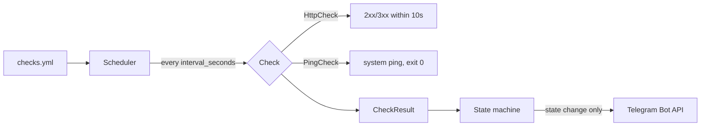
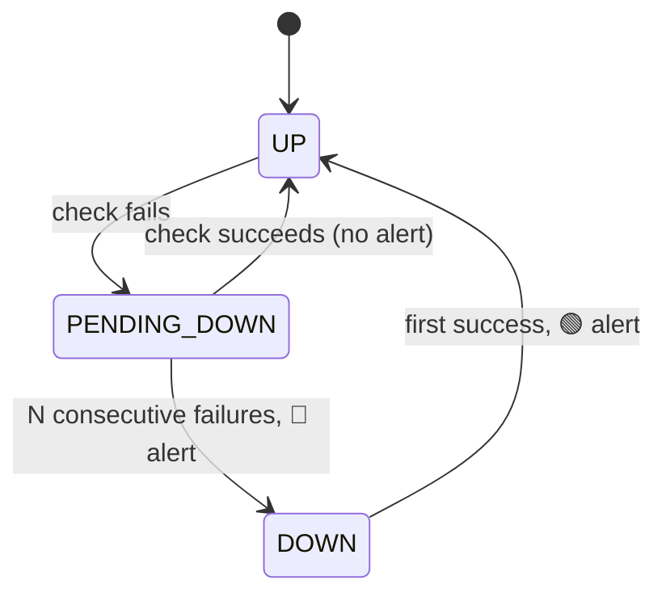

# Vigía

**Vigía** (Spanish for *watchman*) is a small monitoring service for my homelab.
It runs liveness checks against every service in production and sends Telegram alerts
**only on state changes**: one message when something goes down, one when it recovers,
and silence in between. No dashboards, no duplicate pings at 3 AM.

Built with Java 21 and Spring Boot 4, deployed as a systemd service inside an
unprivileged LXC container on Proxmox, where it currently watches 11 real services
(Paperless-ngx, Immich, n8n, AdGuard Home, Actual Budget, Syncthing, FacturaScripts,
Caddy, a Synology NAS and the Proxmox host itself).

## How it works



Each service has its own in-memory state machine. A single failed check never alerts:
transient blips are absorbed by a `PENDING_DOWN` state and a consecutive-failure
counter.



A sustained outage produces exactly one alert. Recovery is announced on the first
successful check after `DOWN`. The whole project exists to guarantee that property;
everything else is plumbing around it.

## Configuration

Watched services live in an external YAML file; nothing is hardcoded. The path is
provided at startup via `--vigia.config`:

```yaml
checks:
  - name: paperless
    type: http            # http | ping
    target: https://docs.example.com
    interval_seconds: 60
    failures_before_alert: 3
```

The config is validated on startup: unknown types, missing fields, non-positive
intervals and duplicate names all fail fast with a clear message.

Telegram credentials are **never** part of the repo or the YAML. They are read from
environment variables, injected in production by systemd from a root-only file:

```
VIGIA_TG_TOKEN=...   # bot token from BotFather
VIGIA_TG_CHAT=...    # target chat id
```

Without them, Vigía still runs and logs alerts instead of sending them, which is
what development runs use.

## Design decisions

- **Alerts only on transitions.** A monitor that sends twenty messages for one
  outage ends up muted, and a muted monitor is worse than none.
- **HTTP 3xx counts as alive** and redirects are not followed. A login redirect
  already proves the service is up.
- **Ping shells out to iputils** instead of using `InetAddress.isReachable`, which
  silently degrades to a TCP probe when it lacks raw-socket privileges.
- **Ping targets starting with `-` are rejected**, so a config value can never be
  smuggled in as a ping flag.
- **A crashing check counts as a failure** and can never kill its own schedule: a
  task that lets an exception escape `scheduleAtFixedRate` is cancelled forever.
- **The Telegram token is redacted** from every error message the notifier can
  throw.

## Why Spring Boot? (isn't that overkill?)

Fair question. A cron job running `curl` could cover most of this, and a homelab
pinger does not need a framework. I picked it anyway, for three reasons.

1. **It is a learning project with production stakes.** The goal was to practice
   the stack the Java job market actually runs (Maven, Spring configuration and
   lifecycle, JUnit 5, packaged deployments) on a service whose failures I
   personally care about. A tutorial teaches syntax; a service my homelab depends
   on teaches operations: systemd, unprivileged containers, secrets handling, and
   what happens after a reboot.

2. **The framework footprint is deliberately minimal.** Only the base starter: no
   web server, no actuator, no Spring Data. Spring provides bootstrap, graceful
   shutdown, externalized configuration and single-jar packaging. The monitoring
   engine is plain JDK (`java.net.http.HttpClient`, `ScheduledExecutorService`,
   `ProcessBuilder`) and the state machine has zero framework imports. Remove
   Spring and about 90% of the code survives.

3. **Measured in production, the overkill is cheap.** 172 MB resident in a 1.5 GB
   container, 0.8 s startup, a 9 MB jar. And the v2 roadmap (system metrics,
   nightly-job checks, sensor ingestion) grows into the framework instead of
   outgrowing a shell script.

The full story, including the plan this project replaced and the incident on
deployment day, is in
[the blog write-up](https://luisbretones.dev/blog/vigia-homelab-monitoring/).

## Running locally

```bash
./mvnw test                 # full suite
./mvnw package              # build the jar
./mvnw spring-boot:run -Dspring-boot.run.arguments=--vigia.config=./checks.yml
```

## Deployment

Vigía runs as a dedicated no-login user inside an unprivileged Debian LXC:

- [`deploy/vigia.service`](deploy/vigia.service): systemd unit (`Restart=on-failure`,
  credentials via `EnvironmentFile`, mode 600, owned by root)
- [`deploy/99-vigia-ping.conf`](deploy/99-vigia-ping.conf): required sysctl. Debian
  containers ship `ping_group_range` closed to ordinary users, so ICMP checks fail
  with a permission error until the range covers the container's mapped GIDs.

The jar is built on a workstation and copied over; the container only needs a JRE.
Survives container reboots (verified with `pct reboot` + `systemctl is-active`).
All traffic is outbound: an external port scan sees the same before and after this
project, that is, nothing.

## Testing

44 tests, written before or alongside each class, including an adversarial pass:
timeouts against a deliberately slow local HTTP server, 5xx responses, connection
refused, malformed and hostile YAML, duplicate service names, ping targets crafted
as flags, a notifier that throws mid-alert, and assertions that the bot token never
leaks into exception messages. The suite was mutation-checked: breaking the
state-machine threshold on purpose turns 9 tests red across two independent suites.
A test that stays green when you break the code is not testing anything.

## Lessons learned

- `ping_group_range` inside unprivileged LXC containers defaults to *nobody*: ICMP
  datagram sockets are denied to service users until the sysctl is widened, and the
  upper bound must fit the container's mapped GID space.
- Spring Boot 4's base starter no longer ships SnakeYAML; loading custom YAML means
  declaring it explicitly.
- `@SpringBootTest` executes `ApplicationRunner` beans: a fail-fast runner needs a
  valid config in test resources or the context test dies with it.
- Formatters that hook `javac` internals (palantir/google-java-format) break on
  recent JDKs; Spotless with the Eclipse formatter embeds its own compiler and
  doesn't care.

## Roadmap (v2)

- Checks for nightly jobs: vzdump, rsync, Hyper Backup, PostgreSQL dumps
- Weekly self-monitoring heartbeat
- System metrics (disk, RAM, load)
